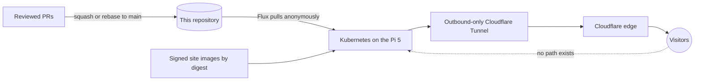

# website-infrastructure

[](https://github.com/snaraj/website-infrastructure/actions/workflows/pull-request.yml)
[](https://github.com/snaraj/website-infrastructure/actions/workflows/codeql.yml)
[](https://github.com/snaraj/website-infrastructure/actions/workflows/scheduled-security.yml)
[](docs/badges/coverage.json)
[](https://github.com/snaraj/website-infrastructure/releases)

Everything needed to run two real websites from one Raspberry Pi 5 at home —
upstream Kubernetes bootstrapped with kubeadm, GitOps with Flux, and
Cloudflare's edge in front — with the paranoia turned all the way up and the
cloud bill pinned at exactly zero.

Imagine the ergonomics of a managed platform, except the hardware is yours,
every byte of configuration is reviewable in this repository, and nothing —
literally nothing — is allowed to cost money or leak where the box lives.
That's this repo.

Once the repository owner's immutable-release and protected-main readiness
receipt passes, every protected-main merge publishes one immutable patch
release of this repository's platform source (`vX.Y.Z`). Both an allowed
one-commit squash and an allowed merge-free multi-commit rebase bind the
complete final main SHA to one release. That source release is an audit and
recovery identity only: it never deploys, promotes, or mutates Kubernetes,
Flux, Cloudflare, DNS, Tunnel state, secrets, or protected custody. Site image
and chart releases remain owned by the two application repositories.



> [!IMPORTANT]
> This repository remains fail-closed wherever reviewed evidence is unresolved:
> values marked `REPLACE_*`, `UNRESOLVED`, or explicit all-zero release bindings
> refuse to work. The two website paths are safe-active desired state, but that
> does not claim the owner-attended bootstrap or live convergence has occurred.
> The deployment-state table below tells you exactly how far along things are.

## Website catalog

The sites this platform exists to serve. Each one lives in its own
repository with independent CI and signed releases, and deploys here by
immutable digest only.

| Site | What it is | Source |
| --- | --- | --- |
| [naranjo.online](https://naranjo.online) | Samuel's personal corner of the internet — portfolio, professional home, and whatever deserves a permanent URL. | [snaraj/naranjo.online](https://github.com/snaraj/naranjo.online) |
| [lidersea.com](https://lidersea.com) | The web home of Lidersea — luxury yacht maintenance, customization, and detailing. | [snaraj/lidersea.com](https://github.com/snaraj/lidersea.com) |

Both are Svelte frontends embedded into single dependency-free Go binaries,
shipped as distroless multi-arch containers with Cosign-signed images and
charts. Desired state, live reconciliation, and public traffic are separate
claims; the deployment-state table below is the honest source of truth.

## Designed to expand

The architecture is a castle built for growth: more Pis or a homelab
tier, databases, operators, CRDs, and secrets tooling such as Vault are
all possible later without changing its shape. None of that exists yet —
**only the two websites above are production today**, and nothing else is
promised, deployed, or implied.

Two invariants hold at every stage of that growth: **zero spend on every
platform**, and **security at the core** — fail-closed guards, and merge
and mutation authority that stays with the owner alone.

## The rules the machines enforce

These aren't aspirations — validators, required CI, and reviewed runtime controls reject
violations automatically:

- **$0, forever.** Cloudflare stays on exactly two Free-plan zones; registrar
  renewals are the only authorized charges. Unknown billing behavior means
  NO-GO; we prefer downtime to surprise invoices.
- **No way in.** No inbound WAN ports, no public origin IP, no NodePort,
  LoadBalancer, host network, Ingress controller, or public admin hostname.
  The only public path is an outbound-only tunnel.
- **Nothing secret in the open.** Flux reads this public repo anonymously and
  holds no write credential. The repository carries no secrets at all: runtime
  Secrets are created on the cluster by an owner ceremony. Commit metadata
  itself is scanned — a real email address can't even ride along in a
  trailer.
- **Only what was reviewed runs.** Signed charts are selected by immutable OCI
  digest and verified by Flux against each site's protected-main publisher;
  their workloads remain digest-only.
- **Heavy media stays out of the control plane.** Video, audio, and large
  images never enter Git, embeds, OCI images, ConfigMaps, or etcd — they get
  their own storage story on the platform.
- **Pre-existing host services are discovered read-only** and left untouched
  until conflicts are reviewed with a tested recovery path. A
  privacy-sensitive legacy archive stays an inactive, operator-only concern
  ([ADR 0013](docs/adr/0013-protected-legacy-archive.md)) — never a
  co-hosted workload.

## What lives where

```text
bootstrap/             user-run Pi, Flux, and recovery procedures
docs/                  architecture, ADRs, security model, audits, runbooks
infrastructure/        credential-free OpenTofu for Cloudflare
kubernetes/            desired state for the single environment
policies/              Conftest static controls
scripts/               the "prove it first" validator suite
tests/                 allow/deny fixtures collected by canonical unittest discovery
```

The two sites live in their own repositories
([naranjo.online](https://github.com/snaraj/naranjo.online),
[lidersea.com](https://github.com/snaraj/lidersea.com)) with independent CI
and signed releases; this repository is application-agnostic — it consumes
their signed images and charts by immutable digest through per-site Flux
sources, and no site source code exists here.

## Working locally

One-time setup after cloning — point Git at the repository's hooks so the
pre-push publication gate runs automatically:

```bash
git config core.hooksPath .githooks
```

```sh
make check-fast        # validators + the full test suite (Linux and macOS)
make check             # everything: render, policy, shell, workflow, and guard checks
make coverage          # measure suite coverage; enforce the floor and badge integrity
make pre-push-security # rehearse the exact publication gate before pushing
```

Coverage is measured inside the repository (no external coverage service):
the committed badge is regenerated and byte-verified against
[`docs/badges/coverage.json`](docs/badges/coverage.json) by CI, so the badge
can never claim a number the gate did not measure.

`make check-fast` needs only Python and Git. Tool pins live in
`versions.env`; macOS notes live in
[the local development runbook](docs/runbooks/local-macos-development.md).

## Start here, depending on who you are

- **Reviewing security?** [Practical security model](docs/security/practical-security-model.md),
  then the [threat model](docs/security/threat-model.md) and
  [control matrix](docs/security/security-control-matrix.md).
- **Understanding the design?** [Architecture overview](docs/architecture/overview.md)
  and the ADRs — start with [kubeadm-on-Pi](docs/adr/0011-kubeadm-on-pi.md)
  and [zero-spend Cloudflare](docs/adr/0006-cloudflare-zero-spend.md).
- **Operating it?** The [runbooks](docs/runbooks/), each with explicit stop
  points; no script here is permission to touch a live system.
- **An AI agent?** `AGENTS.md` is the whole contract; audits under
  [docs/audits](docs/audits/) map the current state honestly.

## Forking this

It's intentionally opinionated for its owner's two domains and identities,
but the pattern — fail-closed sentinels, digest-only deploys, zero-spend
guards, validator-enforced privacy — is reusable. Replace each complete
identity tuple (domain, module, package, image, chart, workflow, signature,
DNS, tunnel rule, tests) rather than search-and-replacing one label, and
keep every discovery value sentinel until your own hardware and account
evidence passes. It's a reference platform, not a one-command installer.

## Deployment state

| Gate | State |
| --- | --- |
| Repository and policies | Credential-free scaffold + negative-policy tests implemented; live evidence pending |
| Pi discovery | Read-only discovery completed; private evidence stays off Git |
| Independent recovery drill | Not proven; host/network/cluster mutation blocked |
| Protected legacy archive | Local archive exists; off-device restore proof pending |
| Media storage profile | Disabled pending storage evidence |
| Public heavy-media delivery | NO-GO under the current zero-spend Cloudflare boundary |
| Cloudflare subscription audit | Not run |
| kubeadm/containerd install | In progress on `deploy/pi-live-readiness` |
| CNI + kube-proxy decision | Rendered (Calico VXLAN), install pending |
| Cluster initialization | Historical repository evidence only; no live initialization receipt is claimed here |
| Flux controller install | Not run. `scripts/install-flux-controllers.sh` is the reviewed owner-run installer; no repository install has been executed, and no live execution or current controller version is claimed here |
| Flux live-vs-reviewed drift | Open. The live cluster still runs the stock upstream render; the #141 convergence ceremony was retired unexecuted (issue #299), so converging onto the reviewed narrowed RBAC needs a fresh owner decision and a separately reviewed design |
| `flux-system` egress policy | Committed desired state only; no live application or health is claimed |
| Flux site desired state | Combined #195/#189 candidate: both manifests are unsuspended at exact signed chart digests behind the protected-main-branch source (owner decoupling ruling 2026-09-01, issue #275; the tag-driven selector path retires per `docs/runbooks/site-sync-branch-flip.md`) and two direct `prune: false`, `deletionPolicy: Orphan` reconcilers. Current selections: lidersea.com `0.1.41` and naranjo.online `0.1.71`, captured 2026-09-01 for issues #285 in `docs/assurance/195-chart-acquisition-receipt.json`; acquisition receipts never assert live convergence, so no health claim of any kind attaches to the committed digests. No live equivalence, readiness, or traffic is claimed |
| Flux bootstrap (site sync only) | The recovery successor targets exact `v0.1.43` through an owner-attended create-or-exact transaction with suspended staging and containment; burned `v0.1.41` and `v0.1.42` are never selected. It does not reconcile controllers, controller RBAC, admission, or Cloudflare, and no live convergence is claimed here |
| Tunnel-token ceremony | Not run |
| Cloudflare plan/apply | Not authorized |
| Public exposure | Not authorized |

No script in this repository is itself authorization to mutate an external
system. The narrow site bootstrap requires an exact release, explicit target,
and owner confirmation; every other mutation runbook retains its stop point,
and the owner holds every key.
