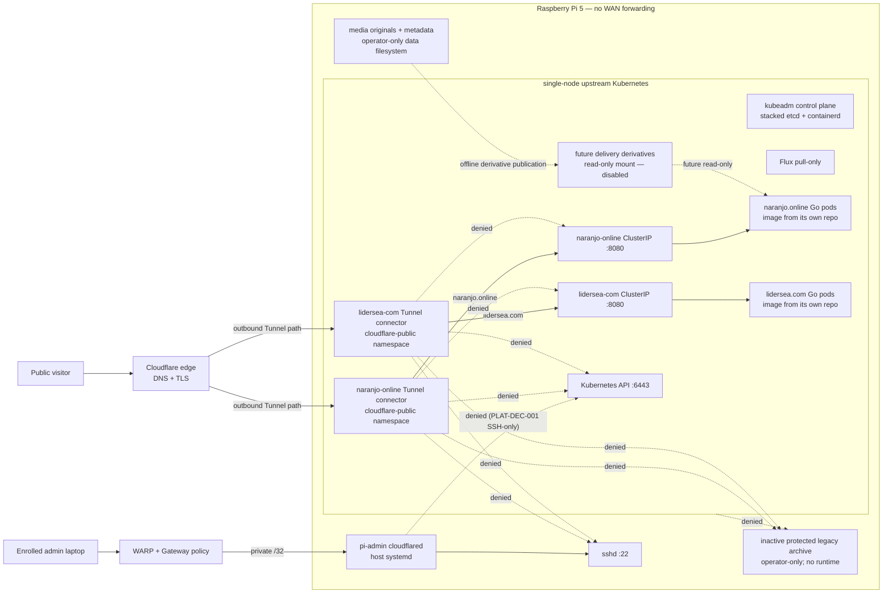

# Architecture overview

The diagram below is the reviewed **target state**, not a claim about the
current Pi. Protected discovery, retirement, capacity, recovery, and live-gate
evidence must all pass before any component is described as deployed.

Every Tunnel connector initiates outbound connections. The residential address
is never a DNS origin and ports 22, 80, 443, and 6443 are not WAN-forwarded.

Each frontend is compiled from Svelte into immutable assets and embedded into
its own Go HTTP binary — in that site's standalone repository, which publishes
the signed image this platform deploys by digest. Each release has its own image, chart, namespace,
ServiceAccount, Service, HelmRelease, and digest-promotion path — and, per
[ADR 0015](../adr/0015-per-site-tunnels.md), its own Cloudflare Tunnel,
runtime token, and proxied apex CNAME, so the two sites share no edge object
or failure domain. The services expose static content and health
endpoints. The naranjo service also contains a tested, bounded file-streaming
capability, but the production chart cannot enable or mount media until ADR
0012's evidence exists. No upload API or runtime transcoder is present.

Each site's Tunnel carries exactly two ordered rules: its own apex hostname,
then a terminal `http_status:404` (ADR 0015). The decided public path is
visitor → Cloudflare edge → the site's own Tunnel → its connector Pod in
`cloudflare-public` → the site ClusterIP on TCP 8080 → the site Pod. The
connector-to-origin leg is plain HTTP inside the default-deny NetworkPolicy
boundary by accepted decision; internal TLS/mTLS per origin is a future
option (ADR 0015). NetworkPolicy permits each connector to reach only its
own site's named TCP 8080 workload. Kustomize remains the
bootstrap/composition layer for Flux, namespaces, RBAC, and HelmRelease
resources.

## Desired state

Flux anonymously reads `main`, decrypts approved SOPS documents with the
out-of-band cluster age identity, and applies them through explicit reconciliation
ServiceAccounts. Public GHCR images are pulled by digest. Cloudflare configuration
is manual OpenTofu with deny-by-default policy and plan-hash approval.

## Failure posture

There is one node, one ISP path, and one Cloudflare dependency. If any fails the
site may be offline. No component is allowed to activate a paid fallback or
expose the origin. Administrative recovery remains host-level and independent
of kubelet, containerd, and the Kubernetes control plane.

The inactive protected legacy archive is also outside Kubernetes. It has no
runtime, listener, Tunnel route, container mount, Flux object, or CI artifact.
Only the operator may inventory and preserve it through the ignored local
contract and the [archive runbook](../runbooks/protected-legacy-archive.md).
Its product classification is public policy, not evidence of a particular
unit, path, version, mount, identity, or archive content on the host.

Production uses upstream Kubernetes bootstrapped by kubeadm with containerd and
stacked single-member etcd. kube-proxy remains installed; its mode and the CNI
selection are intentionally unresolved until Pi discovery proves compatibility
with any VPN/tunnel interfaces, kill-switch behavior, firewall,
nftables/iptables, policy routing, and non-overlapping Pod/Service CIDRs. Kind
is a disposable workstation test target only and does not represent the Pi
runtime or production acceptance.

## Heavy-media delivery boundary

Large source and delivery media are intentionally absent from every rendered
Kubernetes object and image. The future design uses a separately backed-up
originals boundary and a derivative-only read-only mount on a dedicated data
filesystem. Static local PersistentVolume is only a candidate; exact path,
capacity, node affinity, claim, thresholds, and reclaim/rebuild steps remain
unresolved until Pi discovery.

As reviewed from current official Cloudflare documentation on 2026-08-08,
Free/Pro/Business cacheable objects are limited to 512 MB and oversize objects
bypass cache, but that is not the governing permission. Cloudflare's current
self-serve application terms require an eligible paid service for video and
other large-file patterns and publish no safe traffic threshold. Tunnel traffic
still traverses Cloudflare's proxied network. Therefore the zero-spend platform
may serve ordinary pages and modest assets after launch gates pass, while the
heavy-media route remains disabled/404. Caching is optional acceleration only,
never capacity, durability, bandwidth, or entitlement evidence.
