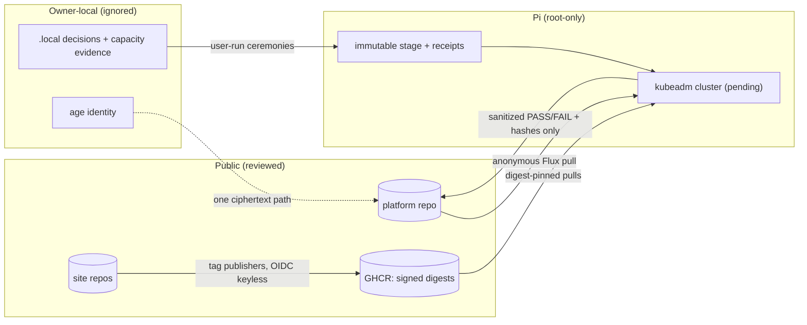

# Phase A — platform surface map, authority matrix, and data flow

Derived exclusively from public/tracked repository material. Private
resources appear by type and ordinal only. Inferences are marked
*(inference)* with the evidence that would prove them.

## Component map

| # | Component | Repository surface | State |
| --- | --- | --- | --- |
| 1 | Host prerequisites + temporary admin access | `bootstrap/pi/*`, `validate_host_prerequisites_plan.py` | user-run, validated fail-closed |
| 2 | Immutable stage transport + manifest verification | Codex lane (private launchers); public hashes only | Codex-owned |
| 3 | Protected-host intake (legacy services) | `validate_protected_host_contract.py`, ADR 0013 | inactive, operator-only |
| 4 | Network preparation (NetworkManager/Calico/CNI) | `validate_pi_network.py`, `validate_cni_manifest.py`, `bootstrap/pi` | validated, unapplied here |
| 5 | Live-input generation (READY / schema-v3) | private channel contract; five role keys + additional unit + VPN link, template-hash-verified | delivered, canonical |
| 6 | Container runtime + host tools | Codex staged installer (signed, HTTPS-only, receipted) | Codex-owned |
| 7 | OCI images (sites) | standalone repos' publishers → GHCR, cosign tag-form identities | v0.1.6 live, verified |
| 8 | OCI charts (sites) | same publishers → `ghcr.io/snaraj/charts/*` | v0.1.6 live, verified |
| 9 | kubeadm init + control plane | `validate_kubeadm_config.py`, `validate_encryption_config.py`; execution Codex-owned | pending live |
| 10 | Recovery tooling + etcd snapshots | `bootstrap/`, `docs/runbooks/*`, Phase E harnesses (planned) | designed, partially tested |
| 11 | Flux GitOps | `kubernetes/flux-system` render, source/kustomization objects, `.sourceignore` | rendered + policy-tested, suspended |
| 12 | Website workload contracts | `kubernetes/websites/*` (HelmRelease/GitRepository/quotas/policies) | rendered + policy-tested, suspended |
| 13 | Admission (Kyverno) | `policies/kyverno/*` staged Audit; enforce is a release gate | staged |
| 14 | Cloudflare edge (tunnel, DNS, zones) | `infrastructure/cloudflare/phases/*` (seven plan-only OpenTofu roots) | plan-only, credential-free |
| 15 | GitHub Actions + GHCR | `.github/workflows/*`, pinned tooling, coverage/badges lanes in site repos | live |
| 16 | Operator recovery + runbooks | `docs/runbooks/*` | retrained 2026-08-10 |
| 17 | Evidence validators for the successor live gate | `validate_flux_release_evidence.py`, `validate_runtime_inventory_evidence.py` | executable, unit-tested |

## Authority matrix

| Principal | May | May not | Enforced by |
| --- | --- | --- | --- |
| Owner (`snaraj`) | merge to `main`, create rulesets, run ceremonies (SOPS, package visibility, billing), authorize mutations | — | GitHub rulesets; every gate assumes owner merge |
| Codex deployment identity | mutate the live Pi within its staged, receipted loop; own `deploy/pi-live-readiness` | push to `main`; touch site repos; publish releases | division contract; branch protection |
| Fable GitHub identity | feature branches, PRs, releases when owner grants tags; observations channel | merge to `main`; mutate Pi platform state; Cloudflare account writes | division contract; rulesets; this program's boundaries |
| GitHub Actions (PR) | read-only validation, no credentials persisted | reach secrets, publish, deploy | `permissions: {}` top-level + job grants; `persist-credentials: false`; tests pin both |
| GitHub Actions (site tag publishers) | build/sign/publish that repo's image+chart, create its Release | manual dispatch, skip flags, tag reuse, cross-repo writes | publisher workflow design + site repo tests; GHCR per-package access |
| Flux (in-cluster) | anonymous read of public repos; reconcile rendered objects | write to Git; pull unsigned images (post-enforce) | anonymous URLs (conftest-pinned); kyverno signature policies |
| Cloudflare tunnel connector | outbound-only connection for the two hostnames | accept inbound origin traffic; exist before launch gates | no inbound rules; suspended HelmRelease; Phase D design |
| kubelet/containerd/workloads | run admitted, digest-pinned, restricted pods | host access, privilege, storage, extra egress | PSA + kyverno + NetworkPolicies (PLAT-EXP-*) |

## Data-flow classes

1. **Public repository data** — everything tracked here and in the site
   repos; reviewed under the privacy validators before every push.
2. **Ignored local decisions** — `*.local` bootstrap inputs, capacity
   evidence (mode-0600, untracked, checked by `assert_capacity_evidence`).
3. **Root-only Pi state** — Codex's staged payloads, receipts, host state;
   never leaves the host; this repo holds only their public SHA-256 values.
4. **In-cluster Secrets** — exactly one designed SOPS/age ciphertext path
   (tunnel token); age private identity never in Git/CI/chat.
5. **GitHub secrets** — none consumed by PR CI (secretless by test);
   publishers use OIDC keyless signing, no long-lived keys.
6. **Cloudflare secrets** — JIT token ceremonies validated hash-bound
   locally (`validate_cloudflare_token_receipt.py`); never in CI.
7. **Signed public artifacts** — images/charts by digest + Rekor entries;
   verification is credential-free and reproducible from any machine.
8. **PR-safe evidence** — sanitized PASS/FAIL + hashes per the ledger
   schema; everything else is BLOCKED-by-design.

## Trust boundaries *(each is a Phase C/D test surface)*

- Public internet ↔ Cloudflare edge (no origin exposure; Phase D).
- Cloudflare ↔ tunnel connector (outbound-only; identity scoping Phase D).
- GitHub ↔ Flux (anonymous read; URL/scope pinned by conftest).
- GHCR ↔ cluster (signature admission; digest pins).
- CI runner ↔ repository (secretless PRs; pinned tools).
- Codex staged loop ↔ everything else (receipted mutations only).
- Fable lane ↔ live host (read-only sentinel within sanctioned cadence).
- *(inference)* the operator's private admin-access plane ↔ cluster
  networking: designed non-overlap; proof requires the Phase G approved
  read-only canaries after the stable signal. Its identity and topology
  stay Pi-local by the placement rule.
