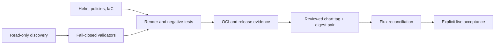

# Scripts: prove it before we touch it

Image and chart publication left this repository with the site sources: each standalone site repository owns its release publisher — dispatched from that repository's protected `main` branch, which is the ref its keyless signatures carry — and this platform consumes only signed digests.
[`ci/verify-existing-oci-release.sh`](./ci/verify-existing-oci-release.sh) is the read-only manual lane: it requires the full-SHA and stable tags to agree and verifies the existing keyless identity without publishing, tagging, signing, or attesting. [`validate_signature_policy.py`](./validate_signature_policy.py) enforces the closed source/render contract for both site-specific Flux chart sources so expected trust strings cannot be hidden in comments or inert fields.
This folder is where we make “prove it first” real: none of these files is permission to touch the Pi, Cloudflare, GitHub, or production, and an unknown answer is always a stop. [`ci/install-tools.sh`](./ci/install-tools.sh) gives CI the exact checksum-pinned validators instead of trusting runner defaults. [`cloudflare-audit.sh`](./cloudflare-audit.sh) reads the live account, both named Free zones, subscriptions, Tunnel, DNS, Gateway, Access, and seat state without printing IDs; [`cloudflare-plan-gate.sh`](./cloudflare-plan-gate.sh) binds a protected OpenTofu plan to the audit fingerprint and the selected phase's exact address, type, count, and field contract; [`validate_cloudflare_token_receipt.py`](./validate_cloudflare_token_receipt.py) validates one bounded local JIT-token ceremony and its independently supplied hashes without reading a credential or contacting Cloudflare; [`validate_cloudflared_tunnel_token.py`](./validate_cloudflared_tunnel_token.py) validates an environment-only Connector token against independently supplied account and Tunnel hashes without printing the token; [`validate-cloudflare-iac.sh`](./validate-cloudflare-iac.sh) initializes and validates all seven isolated phase roots in disposable data directories without accepting a Cloudflare credential; [`mutate_cloudflare_fixture.py`](./mutate_cloudflare_fixture.py) creates precise bad plans; and [`test-cloudflare-policy.sh`](./test-cloudflare-policy.sh) proves every one is denied. [`validate_sops_ciphertext_snapshot.py`](./validate_sops_ciphertext_snapshot.py) binds a protected ciphertext snapshot to the exact age recipient and closed SOPS grammar before an offline MAC/decryption ceremony; [`validate_kubeconfig_snapshot.py`](./validate_kubeconfig_snapshot.py) admits only a single embedded-credential Kubernetes context with no plugin, proxy, token, external-path, or insecure escape hatch; [`validate-windows-credential-workspace.ps1`](./validate-windows-credential-workspace.ps1) is the user-run Windows preflight for that credential workspace, refusing to proceed unless the system volume is fully BitLocker-encrypted and the workspace root is a non-reparse directory owned by the current identity with protected ACLs, so protected snapshots are only handled on a disk-encrypted, access-controlled workstation. [`discover-pi.sh`](./discover-pi.sh) collects the first read-only host picture, [`fingerprint_pi_state.sh`](./fingerprint_pi_state.sh) hashes the network/firewall baseline without publishing it, and [`redact_inventory.py`](./redact_inventory.py) strips common identifiers from deliberately limited discovery output. [`validate_host_prerequisites_plan.py`](./validate_host_prerequisites_plan.py), [`validate_kubeadm_config.py`](./validate_kubeadm_config.py), [`validate_encryption_config.py`](./validate_encryption_config.py), [`validate_pi_network.py`](./validate_pi_network.py), and [`validate_cni_manifest.py`](./validate_cni_manifest.py) each reject one dangerous class of guessed host, cluster, secret-at-rest, routing, or CNI input before a user-run bootstrap can consume it. [`preflight-tools.sh`](./preflight-tools.sh) reports which pinned local tools are present without installing anything; [`render-manifests.sh`](./render-manifests.sh) is the canonical offline Helm/Kustomize/schema/Conftest renderer; [`render-kubernetes.sh`](./render-kubernetes.sh) keeps the familiar wrapper name; [`test-policy-fixtures.sh`](./test-policy-fixtures.sh) requires safe fixtures to pass and unsafe ones to fail; [`install-flux-controllers.sh`](./install-flux-controllers.sh) is the only sanctioned Flux controller install — a constant install target that cannot be pointed at the unsuspended bootstrap root, refusal of any render carrying a Flux custom resource, a Secret, or a NetworkPolicy egress rule, an exact reviewed object count, enforced Pod Security, and a server-side dry run whose reported inventory must stay inside `flux-system` before any create request; it binds the toolchain to the `versions.env` version and digest pins, the bytes to a clean Git checkout whose render hashes to a reviewed `--expect-render-sha256`, and every API operation to an explicit `--kubeconfig`/`--context`/`--server` whose context is proven to resolve to that server; it creates in phases so the controllers are never created into the namespace-wide egress deny they ship with — prerequisites, then the DNS/artifact/API-server allows, then the Deployments, with public HTTPS deferred to `--open-public-egress` until every positive desired replica is current-generation, updated, available, and ready with zero unavailable replicas; and every object receives an unpredictable per-attempt annotation before create-only mutation; rollback admits only matching live identities, uses UID/resourceVersion-preconditioned deletion, leaves foreign collisions or replacements untouched, and proves captured UIDs gone even when responses are lost; [`validate_repository.py`](./validate_repository.py) joins the cross-file layout, privacy, media, secret, workflow, Kubernetes, Cloudflare, activation, and release invariants — including its `dependabot` check, which delegates to [`dependabot_contract.py`](./dependabot_contract.py), a standard-library-only fail-closed structural gate for `.github/dependabot.yml` (`actionlint` only globs workflow YAML, so a corrupted `groups` stanza or an unknown `package-ecosystem` previously passed every check); [`validate_publication_history.py`](./validate_publication_history.py) closes the outgoing commit/tree/blob and metadata history; [`pre-push-security.sh`](./pre-push-security.sh) binds those checks to one clean exact source commit and immutable outgoing range; [`validate-security.sh`](./validate-security.sh) is the short credential-free security entry point; [`release-gate.sh`](./release-gate.sh) separates inert scaffold proof from promoted static proof while its runtime lanes fail closed PENDING the post-cutover successor; [`validate_flux_release_evidence.py`](./validate_flux_release_evidence.py) and [`validate_runtime_inventory_evidence.py`](./validate_runtime_inventory_evidence.py) are that retired live lane's captured-evidence validators, kept executable and unit-tested for the successor gate; [`validate_assurance_ledger.py`](./validate_assurance_ledger.py) validates the platform-assurance evidence ledger fail-closed (canonical records, ordering, uniqueness, forbidden private patterns); [`ci/verify-pull-request-merge-base.sh`](./ci/verify-pull-request-merge-base.sh) proves a pull-request checkout is the exact two-parent join of the live base branch tip and the reviewed head, and prints that verified tip so the history and secret scans cannot scan a narrower range than the one that merges; [`ci/verify-render-determinism.sh`](./ci/verify-render-determinism.sh) proves two independent renders of the authoritative release-transition mode are byte-identical so hash-bound evidence stays reproducible in every release state; [`validate_no_security_toggles.py`](./validate_no_security_toggles.py) sweeps the whole tree for skip/disable/bypass security-toggle idioms outside a justified allowlist (the Coinkite law as a machine check); [`validate_attack_surface_manifest.py`](./validate_attack_surface_manifest.py) validates the Phase H offensive-validation attack-surface contract fail-closed (closed result vocabulary, full critical-surface coverage, no private values); and [`verify-exposure.sh`](./verify-exposure.sh) checks both public domains, security headers, DNS privacy, and closed residential-origin ports after deployment. [`edge-probe.sh`](./edge-probe.sh) is the credential-free acceptance probe for the same two public edges — redirect posture, TLS floor, 0-RTT, HSTS, DNSSEC, readiness, `www` absence, and site distinctness — measured twice per run and scored PASS/GAP/SKIP against the encoded target state; it proves the local TLS client can speak a legacy protocol against a loopback server before it will assert anything about the edge, so a client limitation can never be reported as a server verdict, and it is report-only until `--enforce`. [`cloudflare-account-audit.sh`](./cloudflare-account-audit.sh) is its owner-run authenticated counterpart: one read-only token in the environment, GET requests only, and the configuration facts no external probe can observe (plan and subscription, the six zone settings, DNSSEC, the two per-site Tunnels and their connectors, the absence of a private-network surface, and the DNS inventory), with account, zone, Tunnel and connector identifiers replaced by stable pseudonyms so two captures diff without publishing an identifier inventory. The small Python helpers are here because strict structured validation and streaming redaction need to work with the standard library on a workstation, CI runner, or fresh Ubuntu host; Python is never part of either production website, container, or cluster runtime.
[`validate_cloudflare_preapply_evidence.py`](./validate_cloudflare_preapply_evidence.py) validates the protected current-phase backend/state binding and reviewed manual pre-apply attestation without credentials or network access.
[`site_sync_branch_flip.py`](./site_sync_branch_flip.py) makes every judgment of the issue-275 decoupling ceremony (`docs/runbooks/site-sync-branch-flip.md`) fail-closed and testable: the full-document no-bypass ruleset receipt, selector quiescence by owner-UID lineage over unfiltered inventories, the atomically written private prestate capture, UID- and field-bound compare-and-swap flip/rollback patches, exact poststate and rollback verification, and the outside-in `verify-live` probe that requires the live page's sole fingerprinted bundle inside the committed chart's hash-verified image bytes.
[`flux_rbac_denial_oracle.py`](./flux_rbac_denial_oracle.py) is the bounded read-only Flux denial oracle: it requires exact discovery, faithful raw SelfSubjectAccessReview responses, mixed controls, and held executable and kubeconfig bytes, while its direct checkout entrypoint remains blocked until a separately reviewed trusted-blob launcher exists.
[`flux_rbac_kind_acceptance.py`](./flux_rbac_kind_acceptance.py) is the isolated issue-98/186 acceptance harness: when the owner runs its Make entrypoint from a workstation and checkout they already control, it requires a clean pushed non-main candidate head, binds the matching kind/kubectl/Helm/Go pins and all seven Python/Git/Docker/kind/kubectl/Helm/Go executable identities, and creates a uniquely owned kind cluster with the real Flux controllers. It cold-starts Kustomize under final RBAC with one zero-restart Pod while Helm remains at zero, then cold-starts Helm with one zero-restart Pod while proving cluster-wide Secret denial and preserving Kustomize, proves tenant readiness permissions plus acceptance-only Helm remediation, removes only its own host resources, and writes a bounded mode-0600 receipt outside the checkout. That receipt is local disposable-acceptance evidence, not adversarial stage-zero provenance or promotion authority; the harness accepts no protected kubeconfig and grants no protected-cluster mutation authority.
[`ci/coverage_gate.py`](./ci/coverage_gate.py) enforces the self-hosted coverage contract fail-closed — measured floor, bounded drift against the committed ledger, and byte-exact regeneration of the committed badge — so coverage claims never depend on an external upload service.
[`ci/validate_selector_rootfs.py`](./ci/validate_selector_rootfs.py) inspects the unextracted final selector filesystem archive and rejects missing, duplicate, wrongly typed, wrongly permissioned, or content-drifted trusted-root entries.
[`ci/platform_release_contract.py`](./ci/platform_release_contract.py) is the
standard-library-only policy shared by pull-request CI and the success-only
main publisher: it binds the exact workflow-run identity and final SHA,
accepts either one squash commit or one merge-free multi-commit rebase range
that adds exactly one immutable `changelog.d/` fragment while leaving frozen
aggregate release files untouched, derives the next patch from the contiguous
annotated-tag ledger anchored at `v0.1.9`, preserves the exact burned `v0.1.41`
and `v0.1.42` tags while admitting only the `v0.1.42` to `v0.1.43`
missing-Release successor edge,
returns a distinct pending state for
later rapid merges, requires exactly one fragment across every adjacent ledger
edge, renders fragment-hash-bound notes, verifies the annotated tag, the sole
`v0.1.40` zero-asset bridge, and subsequent immutable two-identity-asset
GitHub-Actions Release records through authoritative REST state, and derives a closed
value-only protected-main, immutable-release, and private-reporting receipt
through GET-only GitHub queries without deploying or changing repository
settings. [`ci/validate_platform_predecessor.py`](./ci/validate_platform_predecessor.py)
validates the sole legacy selector predecessor and rejects alternate or
partially seeded identities. [`ci/verify-platform-release-main-jobs.sh`](./ci/verify-platform-release-main-jobs.sh)
uses only Actions/Contents read to bind the exact completed protected-main job
and step inventory plus the sole exact-SHA CodeQL run, while
[`ci/verify-platform-release-settings.sh`](./ci/verify-platform-release-settings.sh)
uses only the short-lived Administration-read App token to prove the current
immutable-release setting. Each emits a value-only, run-bound attestation; no
read credential crosses into the publisher.
[`ci/wait-platform-release-predecessor.sh`](./ci/wait-platform-release-predecessor.sh)
is the bounded GET-only ordering step: before the Administration-read token is
minted, it waits for the derived predecessor's exact annotated tag and exact
immutable Release, consuming the canonical identity JSON and Sigstore bundle
after the sole `v0.1.40` zero-asset bridge; only the exact burned
`v0.1.42` to `v0.1.43` edge admits an absent predecessor Release. It emits only
a source-bound attestation. Clean
absence retries; foreign, mutable, or partial state fails immediately.
[`ci/publish-platform-release.sh`](./ci/publish-platform-release.sh) is the
directly executable, transaction-tested tag/Release implementation used by the
success-only write job. It completes the frozen v0.1.0 Release only after the
owner has prepared its exact annotated tag, then converges the current release
and both create races only onto exact REST records after re-deriving notes from
the checked-out source, tag ledger, and fragment. Its one incident recovery
verifies and deletes only the exact mutable signed two-asset `v0.1.42` draft
while preserving the annotated tag, then publishes a complete `v0.1.43`; all
other predecessor tags and Releases are revalidated before every mutation
boundary.
[`validate_review_receipt.py`](./validate_review_receipt.py)
validates the portable exact-PR-head adversarial-review receipt SHAPE and
rejects issue resources; it never sees who posted a comment, so reviewer
independence — which AGENTS.md binds to the posting actor — is read from the
forge by the coordinator, and the contract-retired Main Worker Ready-receipt
kind it still carries is transitional until issue #188 removes its call
sites. Meanwhile
[`validate_destructive_test_ledger.py`](./validate_destructive_test_ledger.py)
validates the closed positive kind allowlist and bounded prestate-to-poststate
evidence shape for a separately authorized disposable-workload experiment.
[`ci/destructive_transaction_fixture.py`](./ci/destructive_transaction_fixture.py)
proves the repeated/mixed-signal guard and durable recovery journal only inside
a caller-provided disposable sentinel root; [`ci/ingress_guard_transaction_fixture.py`](./ci/ingress_guard_transaction_fixture.py) proves the SSH-only ingress-guard retrofit's custody, journal-bound recovery selection, closed-state preservation, reboot closure, and exact controller-health behavior inside an unprivileged Linux namespace. None of these tools authenticates
an agent identity, grants a live window, contacts a cluster, or performs a live
mutation.
[`generate_encryption_config.py`](./generate_encryption_config.py) is the
no-display writer used by the protected Pi API-encryption ceremony. It accepts
no key through arguments or environment, uses the operating-system CSPRNG,
validates the complete rendered document, and creates its destination through
an exclusive mode-`0600` descriptor.
`release-gate.sh --live` fails closed PENDING its post-cutover successor. The
successor must capture live state and pass it through the two retained
evidence validators, which server-normalize and exact-match every
authoritative Flux spec and close the global runtime inventory.
`discover-pi.sh` is local-only when invoked with no argument; intentional DNS,
HTTPS, and TCP probes require explicit `--with-egress` after the privacy route
has been proven. [`validate_protected_host_contract.py`](./validate_protected_host_contract.py)
keeps exact active-service and inactive-archive identities in the ignored local
contract while emitting only indexed diagnostics, and
[`validate_protected_runtime_evidence.py`](./validate_protected_runtime_evidence.py)
validates the fresh presence-bound protected-host review attestation without
treating it as a complete live process or storage scan.
[`validate_image_release.py`](./validate_image_release.py) enforces each site's
stable SemVer, production gate, and pull-request version bump without registry
or Git write access; [`validate_release_state.py`](./validate_release_state.py)
extracts only the closed, canonical HelmRelease and parent-Kustomization state
used by CI and release rendering, requiring each site HelmRelease to carry
exactly `deploymentReady: true` and no image override while rejecting duplicate
keys, YAML decoys, and identity drift without a general YAML dependency;
[`validate_release_transition.py`](./validate_release_transition.py) classifies
exact staged, active, ordered rollback/resume, and fully active site states
without resurrecting an admission, platform-service, or aggregate dependency;
[`validate_platform_bootstrap.py`](./validate_platform_bootstrap.py) renders and
validates the owner-attended release-selector bootstrap without performing a
live write; its [`ci/platform_bootstrap_closure.py`](./ci/platform_bootstrap_closure.py)
module closes the effective consumer and child-inventory boundary;
[`create_release_patch.py`](./create_release_patch.py) creates one bounded,
exclusive review patch for a closed release path, while
[`create_release_candidate.py`](./create_release_candidate.py) performs the
legacy no-follow candidate rewrite and
[`write_review_artifact.py`](./write_review_artifact.py) creates the associated
bounded evidence and effective-values files without following or replacing an
existing path; [`remove_review_transaction.py`](./remove_review_transaction.py)
removes only an exact failed transaction without traversing a symlink root.
Those four primitives remain non-authoritative legacy surfaces; no active site
release path calls them.
[`validate_pr_flow.py`](./validate_pr_flow.py) holds the allow/deny
branch-name and push-refspec rules behind the gh-pr-flow skill — pure
policy with no Git execution, network, or credential logic;
[`promote-image.sh`](./promote-image.sh) is an unconditional retirement stub:
it exits nonzero before Git, registry tools, or network access. Forward changes
and rollbacks now review one exact audit-tag/OCI-manifest-digest pair in the
site `source.yaml`; an unavailable older digest stops instead of selecting a
fallback. The chart stays the sole workload-image authority, so the platform
never writes image repository, tag, or digest values into a site HelmRelease.
[`validate_admin_ingress_contract.py`](./validate_admin_ingress_contract.py)
holds the public schema for the ignored root-owned admin-ingress contract
(the reviewed administrative VPN ingress interfaces behind the SSH-only
decision PLAT-DEC-001), rejecting duplicates, whitespace ambiguity, symlinks,
hard links, non-root ownership, partial reads, and LAN/CNI interface classes
with fixed value-free tokens; and
[`validate_ingress_guard.py`](./validate_ingress_guard.py) is the semantic
verifier, deterministic renderer, and tracked-artifact gate for the SSH-only
host-ingress guard: it normalizes structured `nft -a -j` output against one
closed expected model (TCP 22 preserved; 2379/2380/6443/10250 terminally
denied per reviewed interface), requires the exact current envelope/metainfo
and table/chain/rule/counter output shapes, requires bounded and distinct owned
rule handles, and refuses duplicate/non-finite raw JSON, table flags (including
`dormant`), sets, maps, inversions, wildcards, alternate families, decoy chains,
malformed handles/counters, and unknown grammar, so the guard's proof can never
be widened or bypassed by rule indirection.

## Adding a validator

The invocation-parity suite (`tests/security/test_validator_invocation_parity.py`)
fails any `validate_*.py` that appears on one of its surfaces but not the
others — the drift class commit 3ad45c6 had to close by hand. A new
validator therefore lands as one reviewed change touching every surface:

1. the script itself under `scripts/`, with its battery in `tests/security/`
   (the compile sweep in the pull-request workflow enrolls every tracked
   `scripts/**/*.py` automatically — there is no compile list to forget);
2. `scripts/validate-security.sh`, the local credential-free entry point —
   or, when the validator cannot run there (event-scoped input, render-lane
   coupling), a justified entry in the parity suite's CI-only allowlist
   naming the tracked local surface that provides the equivalent run;
3. the inline invocations in `.github/workflows/pull-request.yml`;
4. the guide paragraph above — `tests/security/test_scripts_readme.py`
   requires exactly one link per script.
