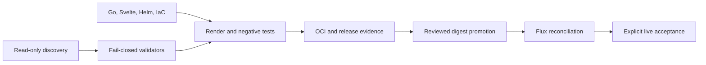

# Scripts: prove it before we touch it

[`validate_frontend_dist.py`](./validate_frontend_dist.py) checks each generated Vite tree without a browser or network, rejecting remote or missing resources, source and source-map output, unhashed immutable assets, symlinks, and explicit byte-budget overruns before Go embeds it.
[`ci/publish-oci-artifact.sh`](./ci/publish-oci-artifact.sh) publishes the exact scanned multi-platform graph with serial, bounded content-addressed retries, then downloads the complete remote graph into a fresh OCI layout so a short GHCR child-manifest visibility delay cannot make an otherwise proven release flaky or change its digest.
This folder is where we make “prove it first” real: none of these files is permission to touch the Pi, Cloudflare, GitHub, or production, and an unknown answer is always a stop. [`ci/install-tools.sh`](./ci/install-tools.sh) gives CI the exact checksum-pinned validators instead of trusting runner defaults, while [`ci/verify-oci-artifact.sh`](./ci/verify-oci-artifact.sh) proves each site’s final amd64/arm64 OCI graph, distinct bounded application layers, vulnerability scan, and per-platform SBOM before publication. [`cloudflare-audit.sh`](./cloudflare-audit.sh) reads the live account, both named Free zones, subscriptions, Tunnel, DNS, Gateway, Access, and seat state without printing IDs; [`cloudflare-plan-gate.sh`](./cloudflare-plan-gate.sh) binds a protected OpenTofu plan to that audit fingerprint and the exact eight-resource allowlist; [`mutate_cloudflare_fixture.py`](./mutate_cloudflare_fixture.py) creates precise bad plans; and [`test-cloudflare-policy.sh`](./test-cloudflare-policy.sh) proves every one is denied. [`discover-pi.sh`](./discover-pi.sh) collects the first read-only host picture, [`fingerprint_pi_state.sh`](./fingerprint_pi_state.sh) hashes the network/firewall baseline without publishing it, and [`redact_inventory.py`](./redact_inventory.py) strips common identifiers from deliberately limited discovery output. [`validate_host_prerequisites_plan.py`](./validate_host_prerequisites_plan.py), [`validate_kubeadm_config.py`](./validate_kubeadm_config.py), [`validate_encryption_config.py`](./validate_encryption_config.py), [`validate_pi_network.py`](./validate_pi_network.py), and [`validate_cni_manifest.py`](./validate_cni_manifest.py) each reject one dangerous class of guessed host, cluster, secret-at-rest, routing, or CNI input before a user-run bootstrap can consume it. [`preflight-tools.sh`](./preflight-tools.sh) reports which pinned local tools are present without installing anything; [`render-manifests.sh`](./render-manifests.sh) is the canonical offline Helm/Kustomize/schema/Conftest/Kyverno renderer; [`render-kubernetes.sh`](./render-kubernetes.sh) keeps the familiar wrapper name; [`test-policy-fixtures.sh`](./test-policy-fixtures.sh) requires safe fixtures to pass and unsafe ones to fail; and [`test-kind.sh`](./test-kind.sh) optionally exercises those contracts against a disposable, owned local Kind cluster without pretending it is the Pi. [`validate_repository.py`](./validate_repository.py) joins the cross-file layout, privacy, media, secret, workflow, Kubernetes, Cloudflare, activation, and release invariants; [`validate-security.sh`](./validate-security.sh) is the short credential-free security entry point; [`promote-image.sh`](./promote-image.sh) verifies one selected site’s published digest and edits only its GitOps values without committing or pushing; [`release-gate.sh`](./release-gate.sh) separates inert scaffold proof, promoted static proof, and explicitly acknowledged live evidence; and [`verify-exposure.sh`](./verify-exposure.sh) checks both public domains, security headers, DNS privacy, and closed residential-origin ports after deployment. The small Python helpers are here because strict structured validation and streaming redaction need to work with the standard library on a workstation, CI runner, or fresh Ubuntu host; Python is never part of either production website, container, or cluster runtime.

